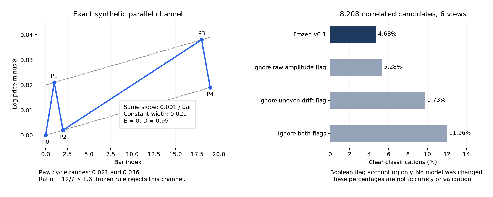

# 两浪策略续研报告｜2026-09-05

**本轮已把“分类覆盖很低”推进为两项可复查的定义问题：原始周期振幅会混入漂移和时长；多项拒判条件又在重复检查相近的形态偏差。与此同时，现有审查窗口在合并时间重叠后，每年只剩一个共同块，无法支撑协议要求的年内分块置信区间。**

识别规范 v0.1、阈值、原始数据和十五工具身份均保留。没有独立人工真值，形态验收状态仍是 `morphology_replication_not_yet_accepted`。本次没有开展第三浪优势、跨级别接管或交易收益研究。

## 1. 本次实际完成了什么

| 工作 | 本轮执行范围与结果 |
|---|---|
| 续接身份核对 | GitHub 私有仓库 `staryocean0/factorlab-two-wave-strategy-lab`，草稿 PR #1，最新 head `0b7ca8f31bcea1d21d86caca143512ac38c4ef82` |
| 拒判联合诊断 | 读取上次 6 视图 × 3 尺度、18 组完整记录，共 8,208 个相关候选；明确 384、拒判 7,824 |
| 数学反例 | 严格平行等宽、匀速漂移的两个原价反转周期，仍可能仅因周期原始振幅比被拒判；已通过完整流式引擎测试 |
| 回放补齐 | 按原 v0.1 重新运行 6 视图的 `.01` 基准，共 18,992 根源记录、2,736 个候选；回放包含各视图 2015—2020 的全部已供行 |
| 原结果一致性 | 六组基准结构记录与上次逐字节相同；六组前缀检查均通过 |
| 审查窗口设计审计 | 6 视图基准的 42 个预选窗合并为 6 个日历块；每年一个跨产品共同块，区间估计保持空值 |
| 人工评价支持 | 新增双人意见对照、签署仲裁、完整窗口控制和相关性 bootstrap；空表、准备命令与可运行接口已交付 |
| 最小盲审材料 | 一个既定窗口的在线、离线盲图，数据包不含算法极值或分类；没有代替人填写标签 |

本轮统计仍限于上述六视图。前次 GitHub 全量 14 视图运行属于历史证据；本轮未读取其完整工件，也未在 GitHub 运行新增诊断，不能将六视图的拒判分析外推到十四视图。

## 2. 为什么不能简单放宽一个条件

以下保持同一组已确认五点、原拟合与 D 不变，仅对已有拒判标记做集合运算。它是读取旧开发结果后设计的归因诊断，**不是预注册模型比较，也没有修改识别器或生成新交易事件**。

| 描述性试算 | 明确候选数 / 全部候选 | 明确比例 |
|---|---:|---:|
| 原 v0.1 | 384 / 8,208 | 4.68% |
| 只忽略原始周期振幅变化标记 | 433 / 8,208 | 5.28% |
| 只忽略多数相位漂移不均匀标记 | 799 / 8,208 | 9.73% |
| 同时忽略上述两项 | 982 / 8,208 | 11.96% |

6,611 个候选触发漂移不均，但其中只有 415 个仅被这一项阻断；其他对象仍有别的拒判原因。即使同时忽略两项，明确输出也远不到原协议提议的 60% 覆盖水平。更高覆盖是否正确，必须用独立形态标签判断，不能用这些比例冒充准确率。

五点平行线回归只有两个残差自由度。本次给出一个代数分解：拟合误差 E 的平方可写为“多数相位曲率”与“高低相位斜率差”的加权和。在 8,208 个有效结构上，重构最大绝对误差约 `2.24e-13`。所以拟合误差、局部漂移差、两相位斜率差不是三份统计独立证据；它们的门槛和权重仍不同，不能直接认定任意一条普遍多余。

完整公式、每项规则、共现关系和两个真实单规则案例见[拒判数学诊断](two_wave_rejection_diagnostics_20260905.md)。

## 3. 一个可以严格证明的定义冲突

令五个点满足 `x=8+0.001t+0.02I_high`，时刻为 `0,1,2,18,19`。相应 log-price 为 `8.000,8.021,8.002,8.038,8.019`。

这五点处于同一匀速、等宽平行通道：`D=0.95`、`E≈0`、上下沿斜率一致，通道宽度始终为 `0.02`；各原价反转腿都超过固定门槛 `.01`。但两周期的原始三点极差分别为 `.021` 与 `.036`，比值 `12/7≈1.7143`，超过现行 `1.6` 阈值。最终只因 `cycle_amplitude_change` 拒判。

反例已加入完整流式测试，包含初始化排除及第五点后续反弹确认；并非只把手工五点直接塞入公式。它证明“等宽、匀速漂移的两浪”与“两个周期原始极差相近”不是等价概念。原始极差包含趋势漂移乘以相位时长，不能直接解释为周期的去漂移宽度。

另一个更接近主观形态的问题是：两浪都向下漂移，但第二浪漂移速度更快，是否仍应认为父结构是下跌趋势？目前 `uneven_phase_drift` 要求速度也足够接近。真实记录中有只因这项被拒判的例子，但未经人工标注，不能称它是误判。

因此，下一版值得讨论的是这些额外约束究竟属于“主分类必须满足的条件”，还是“附加形态属性”。本轮只提供诊断证据，未擅自删除门槛，也未将去漂移振幅替换为新的识别公式。

## 4. 评价设计本身还存在一个缺口

原协议按产品和年度取窗口；当某产品年度不足 512 根时，使用该年完整可用区间。六视图中，60m 和每日视图形成了整年核心，覆盖同年的 30m 核心。

按照“时间相交的审查窗先合并、跨频率同一日历窗共享块”的规则，42 个预选窗合并为 2015—2020 共六个年度块。再按年度分层重采样时，每层只有一个块，反复抽取仍是同一个块，无法估计该层的采样变异。这不是增加相位、尺度或候选数量就能解决的问题。

新增 bootstrap 工具采用跨产品共同权重，保留年度/产品/尺度参与关系；默认每个联合层至少五块才尝试区间估计。五块是明示的保守实现下限，并非 v0.1 已预注册数值；但本次只有一块，即使把下限设为二也仍然不满足。无标签、未完整审查或稀疏层都输出 `null`，不以独立结构抽样替代。

**增加人工标签本身，仍不能修复上述块结构。** 正式验收前需要另起评价设计版本，在不看标签结果的前提下规定可以支持重采样的共同日历分块与窗口安排，保留 v0.1 的窗口清单及其局限。候选方向是先规定较短共同日历核心，跨频率共享核心，并记录结构跨核心与时间依赖的处理；不能为了得到更窄区间而事后缩短窗口。本轮没有重抽窗口或修改冻结协议。

详见[不确定性方法](two_wave_uncertainty_method.md)与[窗口设计审计](../../cloud_results/two_wave_continuation/window_block_audit.json)。

## 5. 可直接开始的盲审与完整回放

- [在线盲审试用](../../cloud_results/two_wave_continuation/blind_pilot/pilot_online_blind.html)：原数据最多到 bar #978，文件本身不含之后行情，也不含算法记录。
- [离线盲审试用](../../cloud_results/two_wave_continuation/blind_pilot/pilot_offline_blind.html)：同一核心，另加 128 根后文，最多到 #1106。应由未承担该样本独立在线参考的人进行离线审查。
- [完整基准回放](../../cloud_results/two_wave_continuation/baseline_full_replay/replay.html)：六视图的 `.01` 基准均覆盖全部已供历史，解决上次每组仅前 1,200 根的展示限制；仍保留逐根快照、算法叠加与曝光标记。
- [首轮盲审步骤](two_wave_blind_pilot_instructions.md)：包括极值、核心范围、导出与来源声明。
- [双人标注与仲裁使用说明](two_wave_annotation_adjudication_workflow.md)：可准备空表、保留双方原始意见，并显式签署仲裁。

试用核心按原清单取 `30m_offset_15/.01` 第一个时间窗口，原序号 `723—978`，上海时间 2015-07-02 13:45 至 2015-09-01 10:15；没有根据分类结果选择。它只用于统一操作和形态含义，不替代离线、在线各至少 200 个去重对象且每个明确类至少 30 个的正式要求。

新仲裁流程保留漏配、分类分歧、容差内几何差异、未解决案件和窗口排除原因。双人意见一致也需要明确签署哪个原始记录成为规范参考；程序不自造真值。现有 HTML 导出可以用 `--prepare-review` 补充空的来源、理由和置信度字段，留待实际审查者填写。

## 6. 验证证据与限度

最终完整测试为 **197 passed**（原 125 项、新增 72 项），新增代码 Ruff 检查通过。逐字节核对、文件哈希、Python 环境及验证器结果记录于[本轮验证清单](../../cloud_results/two_wave_continuation/verification.json)。独立代码审查发现并修复了完整窗口漏阻断待仲裁案件、跨源签署后重复真值、显式非独立来源进入 CI、未支持的信息时钟，以及完整审查声明类型/冲突等问题，并补上针对性回归测试。

本地 `validate_theme_package.py` 未通过：它在第一个缺失的较大 Parquet 处停止。当前工作区仍缺八个源文件；已存在的原冻结资产没有发生哈希变化。没有修改清单或放松验证器来制造“全包通过”。上次 GitHub 的 125 项测试和全包通过不能代替本次新增代码的远端验证。

HTML 的嵌入数据范围、无算法记录和脚本语法已检查，诊断 PNG 排版已实际查看；本轮没有完成真实浏览器播放、点选和下载的交互验收。在线盲图只能提供理想 bar 前缀，不能证明供应商历史实时可得；六视图原 `available_at` 时钟约束仍保留。

当前真实独立人工标签为零，因此 precision、recall、macro-F1、真实混淆矩阵和标签指标置信区间仍无结果。歧义纳入/排除敏感性也仍待真实参考后执行。

## 7. 保存状态与续接顺序

本轮尝试通过 GitHub `create_tree` 写入新增汇总日志脚本和工作流时，自动审批拒绝该动作，理由是未认可向该仓库上传新增私有研究代码及工作流的明确授权。随后只读核对账号、仓库和既有交付授权说明后重试一次，仍被拒绝；此后已停止 GitHub 写回，未改用其他上传路径。**本轮新增代码、报告及审查材料尚未进入远端 PR。**

已准备增量补丁和完整续研交付包。待用户明确确认写回 `staryocean0/factorlab-two-wave-strategy-lab` 的 `codex/two-wave-phase1-20260905` 分支后，可先核对远端仍从原基线延续，再写入可审查提交，保持草稿 PR，不合并主分支。

后续工作依次是：

1. 保存本轮增量并在完整 GitHub 数据包上运行既有 H0 与新增诊断，核对十四视图明细。
2. 用盲审试用明确“匀速是否必要、原始周期振幅是否应阻断主分类”的人工语义，补足完整窗口参考，避免只看算法候选。
3. 在标签评价前独立冻结后续抽样/相关性方案；如调整识别定义，新增规范版本并保留 v0.1 结果。
4. 分别完成离线、在线的形态验收后，再讨论 H1/H2；用户规定的本级反向退出规则继续保留。

精确续接入口见[CONTINUE_HERE.md](../../CONTINUE_HERE.md)。
